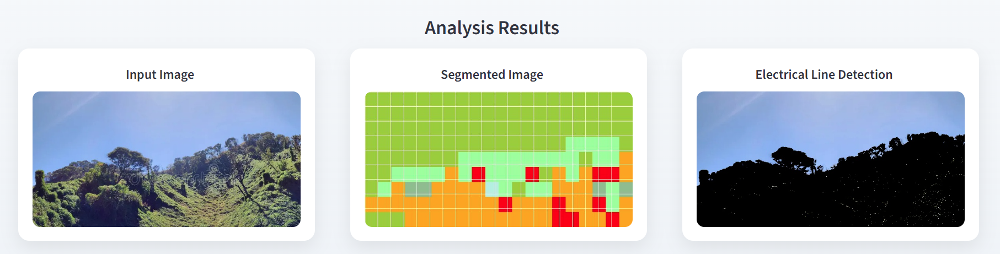

# 🌿 Vegetation Corridor Analysis System

A Machine Learning–based system for vegetation monitoring along electrical transmission corridors using satellite imagery, grid segmentation, Random Forest classification, and electrical line detection.

---

## 📖 Overview

This project analyzes satellite images to monitor vegetation growth near electrical transmission lines. It performs:

* Grid-based image segmentation
* Feature extraction (color-based features)
* Random Forest vegetation classification
* Heatmap visualization
* Electrical line detection using computer vision
* Interactive web interface using Streamlit

The goal is to assist in vegetation risk monitoring around power infrastructure.

---

## 🏗️ System Architecture

### 🔄 Processing Pipeline

1. User uploads satellite image
2. Image is divided into grid cells
3. Color features (HSV/RGB) are extracted
4. Random Forest model predicts vegetation class per grid
5. Segmented heatmap is generated
6. Electrical line detection is performed
7. Results are displayed side-by-side

---

### 📂 Project Structure

```
vegetation-corridor-analysis/
│
├── app/
│   └── app.py                  # Streamlit application
│
├── notebooks/
│   ├── image_division.ipynb    # Grid generation & feature extraction
│   ├── randomforest.ipynb      # ML model training & prediction
│
├── dataset/                    # Training & validation data
│
├── outputs/
│   └── segmented_frame.jpg     # Generated output image
│
├── docs/                       # Documentation & diagrams
│
├── Dockerfile
├── requirements.txt
├── README.md
├── LICENSE
└── .gitignore
```

---

## 🛠️ Tech Stack

* Python
* Streamlit
* OpenCV
* Scikit-learn
* Pandas
* NumPy
* Matplotlib
* Papermill (Notebook execution)

---

## 🎯 Key Features

✔ Grid-based segmentation of satellite imagery
✔ Random Forest vegetation classification
✔ Heatmap visualization of vegetation density
✔ Electrical transmission line detection
✔ Interactive web-based dashboard
✔ Modular ML pipeline execution

---

## 📊 Model Details

* Algorithm: Random Forest Classifier
* Features: Grid-based color features
* Train/Test Split: 80/20
* Evaluation Metric: 95%
---

## 🚀 How to Run Locally

### 1️⃣ Clone Repository

```bash
git clone https://github.com/YOUR_USERNAME/vegetation-corridor-analysis.git
cd vegetation-corridor-analysis
```

---

### 2️⃣ Install Dependencies

```bash
pip install -r requirements.txt
```

---

### 3️⃣ Run Streamlit App

```bash
streamlit run app/app.py
```

Open in browser:

```
http://localhost:8501
```

---

## 🐳 Run with Docker (Optional)

### Build Image

```bash
docker build -t vegetation-app .
```

### Run Container

```bash
docker run -p 8501:8501 vegetation-app
```

---

## 📸 Application Output

The system generates three visual outputs:

1. Input Satellite Image
2. Segmented Vegetation Heatmap
3. Electrical Line Detection

These are displayed side-by-side in the web interface.

---

## 🧠 Engineering Design Decisions

* Controlled working directory for notebook execution (`cwd=PROJECT_ROOT`)
* Centralized output folder (`/outputs`)
* Modular separation between UI and ML pipeline
* Production-style project structure
* Clean dependency management

---

## 📈 Future Improvements

* Replace notebooks with Python modules
* Deploy to AWS / Azure
* Add model comparison (SVM, KNN)
* Add vegetation risk scoring
* Integrate geospatial metadata

---

## 📜 License

MIT License
